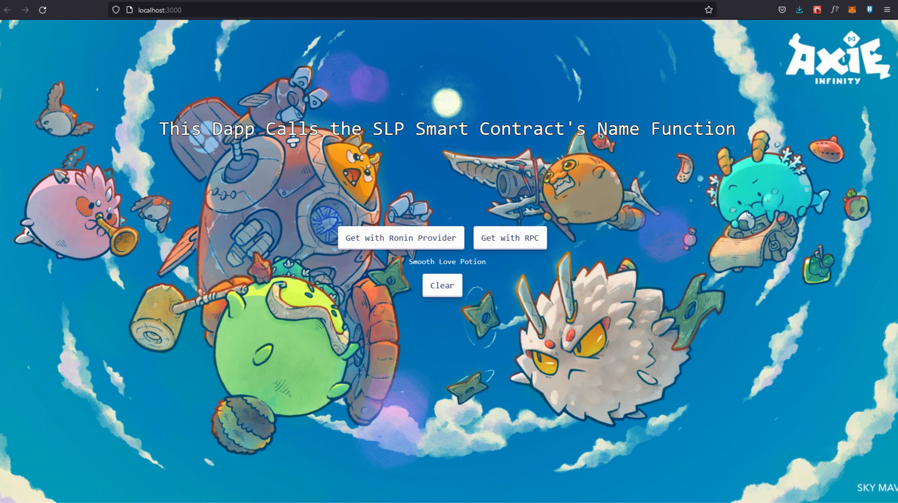

This Dapp calls the SLP Smart Contract's name function and gets the name of the token.

- Added Transaction function, to transfer SLP

IMPORTANT: SLP Doesn't hae decimals, do not use BigNumbers with this token.


    
First, run the development server:

```bash
npm run dev
# or
yarn dev
```


